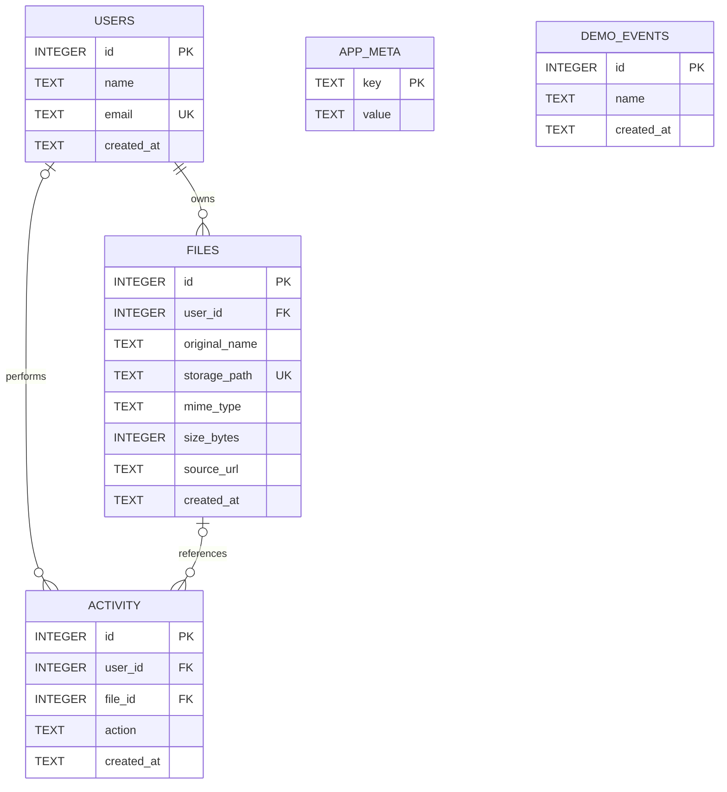

# Diagrama E/R inicial

Este diagrama representa el modelo inicial implementado en SQLite. Los archivos se adaptan a FENIXA como futuras fichas técnicas o imágenes de referencia; esa interpretación debe confirmarse con el docente.

`USERS` conserva la identidad básica; `FILES` conserva metadatos y referencia a su propietario; `ACTIVITY` referencia al usuario y al archivo cuando existen. Nombre, correo, nombre del archivo, ruta, MIME, tamaño y acción tienen restricciones. El correo es único sin distinguir mayúsculas. `size_bytes` debe ser un entero no negativo.

SQLite activa `PRAGMA foreign_keys = ON`. Al borrar un usuario se eliminan sus archivos; las referencias del registro de actividad se anulan para conservar el evento. Se incluyen índices sobre claves foráneas. `APP_META` y `DEMO_EVENTS` se preservan como soporte del prototipo anterior.

Las tablas están configuradas y sus restricciones se prueban con `npm test`; la interfaz aún no registra usuarios, carga archivos ni guarda actividad. El catálogo de componentes y las builds quedan para otra etapa.
